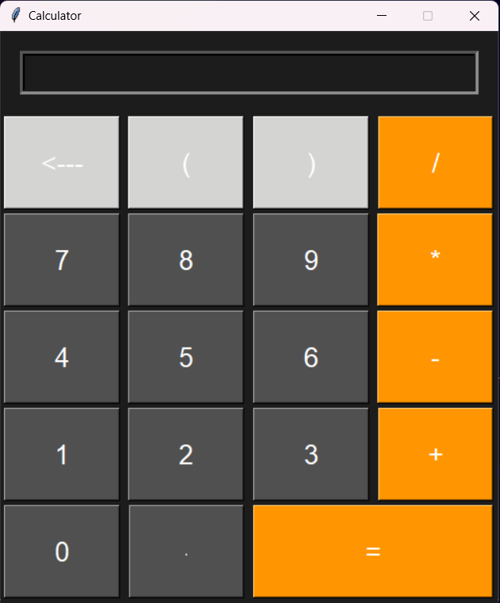

# Calculator Application

## Overview

This is a simple calculator application built using Python's Tkinter library. It provides basic arithmetic operations and supports keyboard input for a more convenient user experience.

## Features

- Basic arithmetic operations: Addition, Subtraction, Multiplication, and Division.
- Support for decimal numbers and parentheses.
- Error handling with a clear error message.
- Keyboard input for ease of use.


## Screenshot


## Installation

1. **Clone the repository:**

   ```bash
   git clone https://github.com/ReaalSATYAM/Calculator.git
   ```
2. **Navigate into the project directory:**
   ```bash
   cd calculator
   ```
3. **Run the application:**
   ```bash
   python calculator.py
   ```
## Usage

- **Number Buttons:** Click the number buttons (0-9) to input numbers.
- **Arithmetic Operations:** Use the `+`, `-`, `*`, and `/` buttons for addition, subtraction, multiplication, and division respectively.
- **Decimal Point:** Use the `.` button to input decimal numbers.
- **Parentheses:** Use the `(` and `)` buttons to include parentheses in your expression.
- **Equal Button (`=`):** Click to evaluate the expression and display the result.
- **Backspace Button (`<---`):** Remove the last character from the input.
- **Keyboard Input:** You can also use your keyboard to input numbers and arithmetic operations.

## Code Description

- **GUI Layout:** The application window is configured with a fixed size and a dark background color. The calculator has a large font for readability.
- **Functions:**
  - `click(number)`: Appends the clicked number or operator to the input box.
  - `backspace()`: Removes the last character from the input box.
  - `calculate()`: Evaluates the expression and handles errors.
  - `key_pressed(event)`: Handles keyboard inputs and triggers corresponding actions.

## Contributing

Feel free to contribute to this project by creating issues or submitting pull requests. Improvements and bug fixes are always welcome.


## Contact
For any questions or feedback, please reach out to  

[](mailto:satyamnaithani14@gmail.com)

[](https://www.linkedin.com/in/satyam-naithani-243076298/)

[](https://github.com/ReaalSATYAM) 
